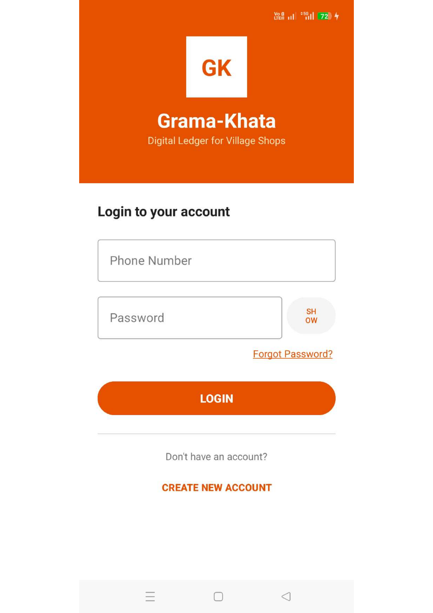
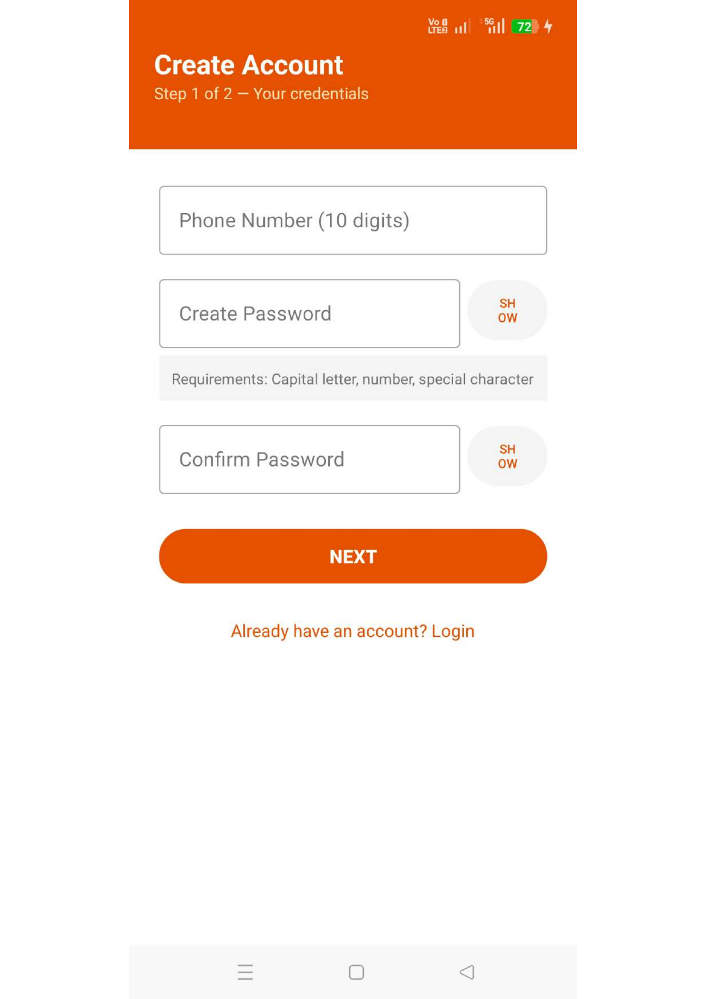
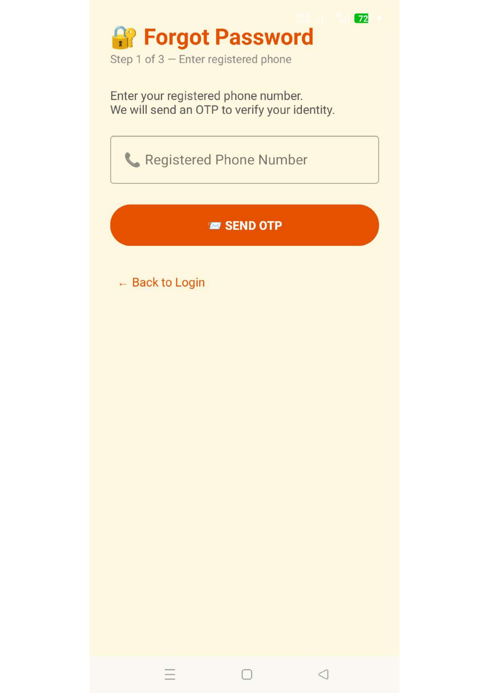
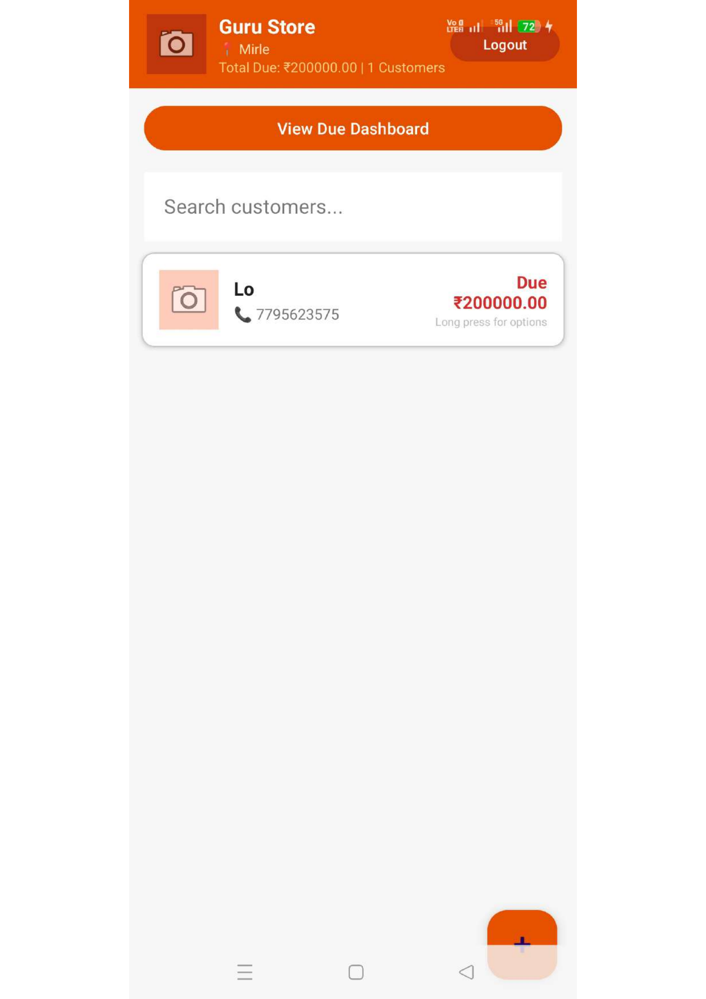
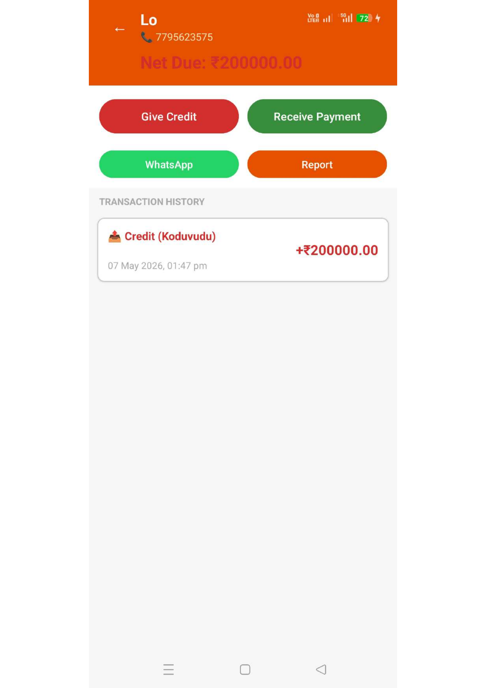
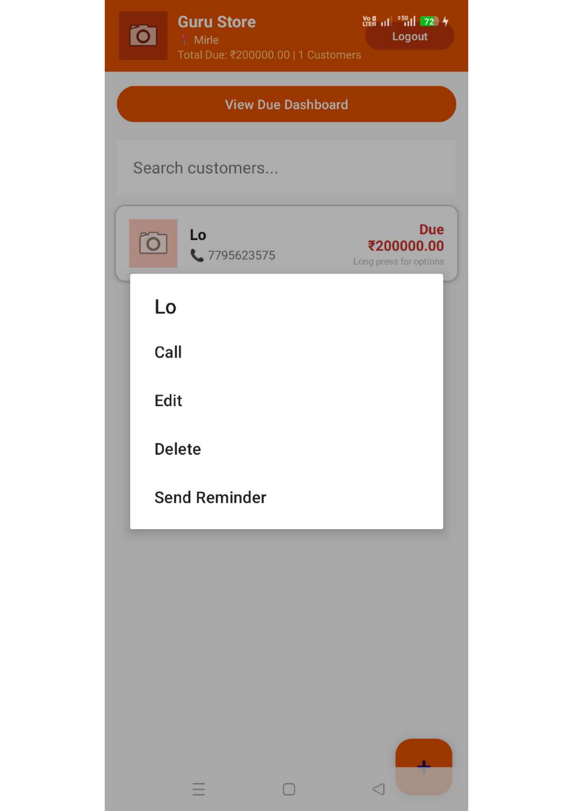
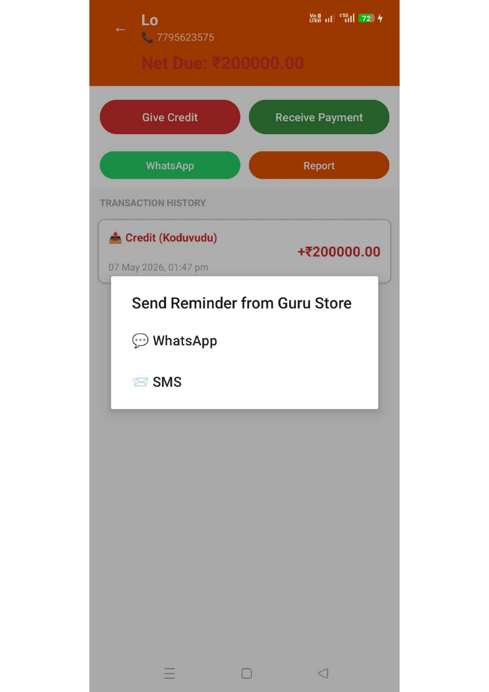

[README.md](https://github.com/user-attachments/files/27958588/README.md)
# 📒 Grama-Khata

<p align="center">
  
  
  
  
  
</p>

<p align="center">
  <b>Grama-Khata</b> — Digital Ledger for Village Shops 🏪<br/>
  A simple, powerful Android app that helps local shopkeepers manage customer credit (udhari), track dues, and send payment reminders — all offline.
</p>

---

## 📱 App Screenshots

| Login Screen | Create Account | Forgot Password |
|:---:|:---:|:---:|
|  |  |  |

| Customer List | Transaction Detail | Long Press Menu | Send Reminder |
|:---:|:---:|:---:|:---:|
|  |  |  |  |

---

## 🌟 About the App

**Grama-Khata** solves a real everyday problem for village shopkeepers — tracking who owes money, how much, and when. Instead of messy paper notebooks, shopkeepers can now manage all customer credit digitally in one place, even without internet.

The app is built around the familiar Indian shop credit system of **Koduvudu** (giving credit) and collecting payments — making it intuitive for any local shopkeeper in India.

---

## ✨ Features

### 🔐 Authentication
- Phone number based **Login & Registration**
- **2-step account creation** — credentials first, then shop details
- Password requirements: Capital letter, number & special character
- **Show / Hide password** toggle
- **Forgot Password** with OTP via registered phone number (3-step flow)

### 🏪 Shop Dashboard
- Header shows **Shop Name**, village/location, and owner info
- Displays **Total Due (₹)** and total number of customers at a glance
- **View Due Dashboard** button for full due overview
- **Search customers** by name in real time
- **Floating + button** to quickly add new customers
- **Logout** button in the top-right corner

### 👤 Customer Management
- Customer cards show **name**, **📞 phone number**, and **Due amount in ₹**
- Due highlighted in **red** for instant visibility
- **Long press** any customer for quick actions:
  - 📞 **Call** — directly call the customer
  - ✏️ **Edit** — update customer info
  - 🗑️ **Delete** — remove customer
  - 🔔 **Send Reminder** — notify about pending due

### 💰 Transactions
- **Give Credit (Koduvudu)** — record credit/udhari given
- **Receive Payment** — record money received back
- **Net Due (₹)** shown prominently per customer
- Full **Transaction History** with date, time, and amount
- Each transaction clearly labeled (e.g., *Credit (Koduvudu)*)
- **WhatsApp** shortcut per customer for quick messaging
- **Report** button for customer transaction summary

### 🔔 Payment Reminders
- Send reminders directly from the app via:
  - 📱 **WhatsApp** — one-tap reminder message
  - ✉️ **SMS** — text message reminder
- Reminder popup branded with your **shop name**

---

## 🛠️ Technologies Used

| Technology | Purpose |
|-----------|---------|
| **Kotlin** | Primary programming language |
| **Android Studio** | Development IDE |
| **SQLite** | Offline local database — no internet required |
| **RecyclerView** | Efficient customer list display |
| **Material Design** | UI components and styling |
| **WhatsApp Intent** | Send payment reminders via WhatsApp |
| **SMS Manager** | Send payment reminders via SMS |

---

## 📂 Project Structure

```
GramaKhata/
├── app/
│   ├── src/
│   │   ├── main/
│   │   │   ├── java/com/gramakhata/
│   │   │   │   ├── LoginActivity.kt
│   │   │   │   ├── RegisterActivity.kt
│   │   │   │   ├── ForgotPasswordActivity.kt
│   │   │   │   ├── MainActivity.kt
│   │   │   │   ├── CustomerDetailActivity.kt
│   │   │   │   ├── TransactionActivity.kt
│   │   │   │   ├── DatabaseHelper.kt
│   │   │   │   └── adapters/
│   │   │   │       └── CustomerAdapter.kt
│   │   │   ├── res/
│   │   │   │   ├── layout/
│   │   │   │   ├── drawable/
│   │   │   │   └── values/
│   │   │   └── AndroidManifest.xml
├── screenshots/
├── README.md
├── LICENSE
├── CONTRIBUTING.md
└── .gitignore
```

---

## 🚀 Getting Started

### Prerequisites
- Android Studio (Hedgehog or later)
- Android SDK — minimum API 21 (Android 5.0+)
- Kotlin plugin enabled

### Installation

1. **Clone the repository**
   ```bash
   git clone https://github.com/lohith44-gowda/GramaKhata.git
   ```

2. **Open in Android Studio**
   ```
   File → Open → Select the GramaKhata folder
   ```

3. **Build & Run**
   - Connect your Android device or launch an emulator
   - Press ▶️ Run or `Shift + F10`

---

## 🔮 Future Enhancements

- [ ] 📄 PDF Report Export per customer
- [ ] ☁️ Cloud Backup (Firebase)
- [ ] 🌐 Multi-language Support (Kannada, Hindi, Telugu)
- [ ] 📊 Analytics / Due Dashboard with charts
- [ ] 🖼️ Customer profile photo support
- [ ] 🔔 Scheduled auto-reminders
- [ ] 🖨️ Print / Share receipt

---

## 👨‍💻 Developer

**R Lohith**
- 📍 Karnataka, India
- 🐙 GitHub: [@lohith44-gowda](https://github.com/lohith44-gowda)

---

## 📄 License

This project is licensed under the **MIT License** — see the [LICENSE](LICENSE) file for details.

---

<p align="center">
  Made with ❤️ for local shopkeepers and village businesses of India 🇮🇳<br/>
  <i>"Simplifying Udhari, one shop at a time."</i>
</p>
